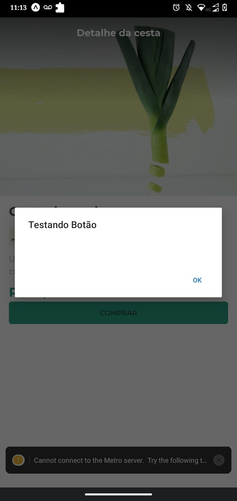

# cestaOrganica





# * Tecnologias Utilizadas:
   ## * React-Native
   ## * Expo
   ## * Javascript
   ## * JSX
   
   
# COMANDOS BÁSICOS PARA RODAR PROJETO DE REACT-NATIVE: 
> Partiremos do pressuposto que você já possui nodeJs instalado em sua máquina
  ## Instalando o expo:
```bash
# Instalando o expo
$ npm install -g expo-cli
```
  ## Iniciando Projeto React-Native:
```bash
# Para seguir a fidelidade desse projeto utilizamos o blank
$ expo init nomeDoProjeto
```
  ## Colocando o projeto para rodar:
```bash
#Rodando o projeto que acabamos de criar
$ expo start
``` 
